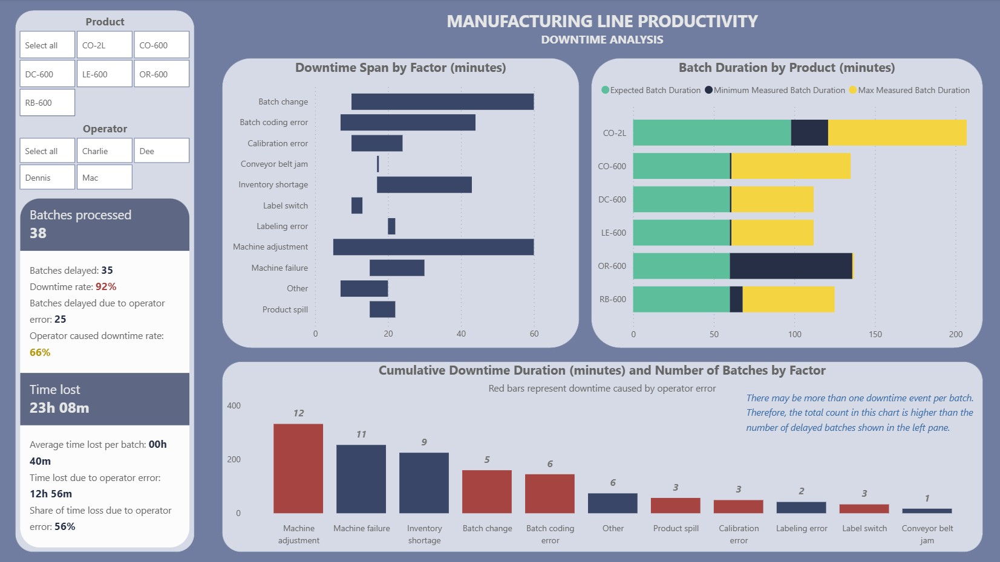
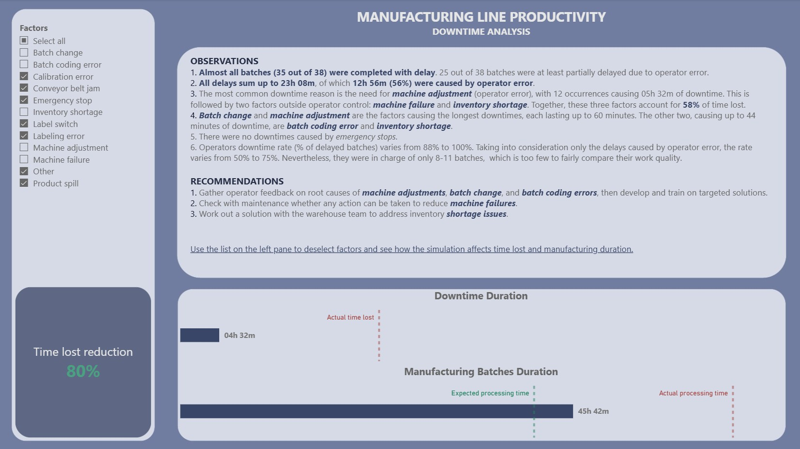

# MANUFACTURING LINE PRODUCTIVITY

Analysis of manufacturing line downtimes for a fictitious soft drinks manufacturer.

**Dataset source:** kaggle.com
**Technologies used:** Power Query, Power BI, DAX

## I. OBJECTIVES

 - Identify downtime patterns.
 - Propose recommendations to reduce the downtime rate.

## II. ANALYTICAL PROCESS

### 1. DATASET

The dataset consists of 4 tables:
 - `Line productivity`
 - `Products`
 - `Downtime factors`
 - `Line downtime`

### 2. DATA VALIDATION AND PREPARATION

Power Query was used to review the data for missing inputs or incorrect formats. Additionally, the following transformations were applied:
- Unpivoted the `Line downtime` table. The table was originally in matrix format, so it was converted to a plain table to enable full integration with the data model.
- Added a `Batch duration` column to the `Line productivity` table.

 ### 3. POWER BI ANALYSIS

The Power BI report is divided into 2 sections.

The first section (`Downtime Overview`) presents key measures and statistics on line productivity and downtimes.

The second section (`Observations and Recommendations`) summarizes the main conclusions and recommendations, and simulates the improvements expected from eliminating selected downtime factors.

Additionally, 3 report pages were created as custom tooltips to enhance the main visualizations in `Downtime Overview`.

### 4. KEY TAKEAWAYS
- Almost all batches (35 out of 38) were completed with delay. 25 out of 38 batches were at least partially delayed due to operator error.
- All delays sum up to 23h 08m, of which 12h 56m (56%) were caused by operator error.
- The most common downtime reason is the need for machine adjustment (operator error), with 12 occurrences causing 05h 32m of downtime. This is followed by two factors outside operator control: machine failure and inventory shortage. Together, these three factors account for 58% of time lost.
- Batch change and machine adjustment are the factors causing the longest downtimes, each lasting up to 60 minutes. The other two, causing up to 44 minutes of downtime, are batch coding error and inventory shortage.

### 5. RECOMMENDATIONS
- Gather operator feedback on root causes of machine adjustments, batch change, and batch coding errors, then develop and train on targeted solutions.
- Check with maintenance whether any action can be taken to reduce machine failures.
- Work out a solution with the warehouse team to address inventory shortage issues.

